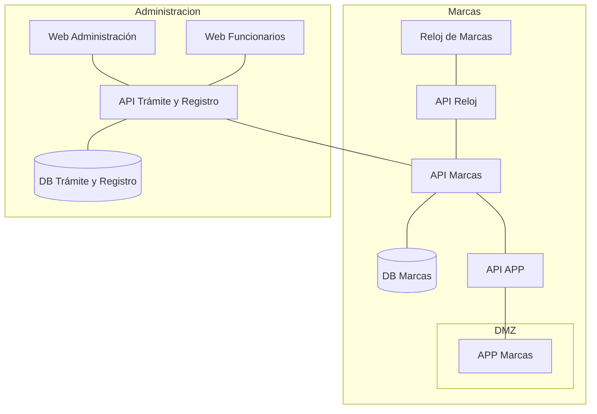

Arquitectura General

```mermaid
flowchart TD
    RP["Reloj de Marcas"]
    AR["API Reloj"]
    ADB["API Marcas"]
    DBM[("DB Marcas")]
    AA["API APP"]
    AM["APP Marcas"]
    
    WA["Web Administración"]
    ATR["API Trámite y Registro"]
    DBTR[("DB Trámite y Registro")]
    WF["Web Funcionarios"]


subgraph Marcas
    RP --- AR
    AR --- ADB
    ADB --- AA    
    AA --- AM
    ADB --- DBM
    subgraph DMZ
    AM
    end
end
subgraph Administracion
	WA --- ATR
	WF --- ATR
	ATR --- DBTR
	ATR --- ADB	
end

class RP,AR internal-link;
```
